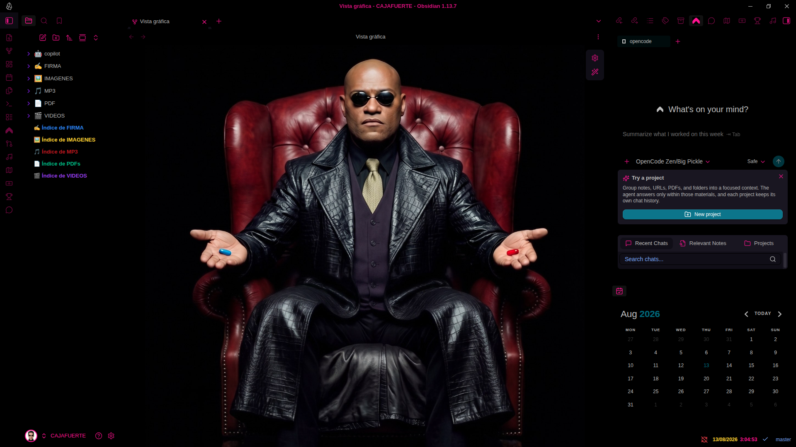
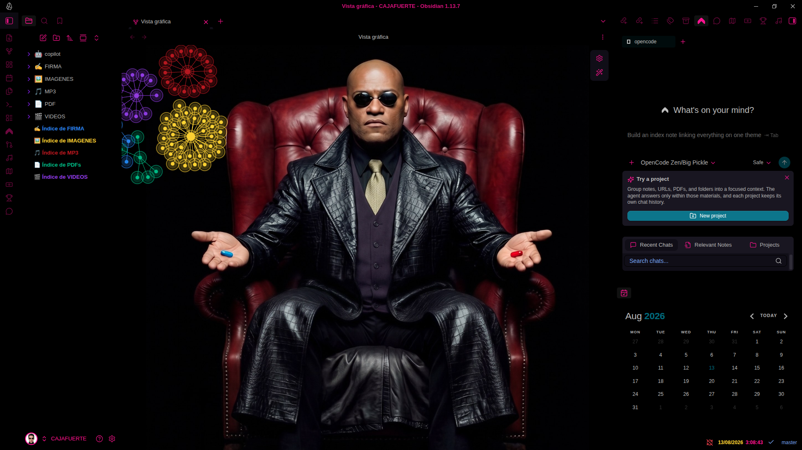

# CAJA FUERTE 🔒

**Tema visual para Obsidian inspirado en The Matrix (1999).**

[](https://bit.ly/donar-paypal-jcarlo)

[](https://github.com/AreAjoErda/CAJAFUERTE)
[](https://github.com/AreAjoErda/CAJAFUERTE)
[](https://github.com/AreAjoErda/CAJAFUERTE)

Interfaz completamente negra con acentos en rosa intenso y morado, el fondo del grafo con **Morfeo sentado en su sillón**, avatar de **NEO** en el perfil del vault, reloj en vivo con fecha, y una barra de iconos personalizada con accesos directos a tus aplicaciones.

## 📸 Capturas

### Vista sin el grafo



### Vista con el grafo minimizado



## ✨ Características

- 🖤 **Interfaz en negro puro**: paneles, franja de iconos, pestañas y barra de estado sin líneas visibles.
- 👓 **Morfeo en el grafo**: el fondo de la vista gráfica muestra a Morfeo sentado, con los nodos flotando sobre él.
- 🕶️ **Avatar de NEO** en el perfil del vault (abajo a la izquierda).
- 💗 **Iconos en rosa intenso** (`#ff1493`): pestañas, barra lateral, explorador, controles del grafo y chat de Copilot.
- 🟣 **Flechas de colapso en morado intenso** (`#8b00ff`).
- 🟡 **Fecha del reloj en amarillo** (`#ffd700`), hora en rosado con segundos en vivo.
- ⚡ **Barra de iconos superior** con accesos directos: WhatsApp, YouTube Music, Google Maps, Convertidor de Divisas, Fútbol en Vivo y el agente Copilot.

## 🖥️ Compatibilidad

Funciona en **Windows, Linux y macOS**. El tema está hecho con **CSS puro de Obsidian** y las imágenes (Morfeo y NEO) van **incrustadas en base64** dentro de los archivos CSS, así que **no depende de rutas ni del sistema operativo**: se copia, se activa y funciona igual en cualquier plataforma.

Los plugins opcionales (custom-frames, grandfather, grafo-vivo) son de la comunidad de Obsidian y también funcionan en las tres plataformas.

## 📦 Instalación

1. Descarga el proyecto: botón **Code** → **Download ZIP**.
2. Descomprime y copia los archivos de la carpeta `snippets/` a la carpeta de snippets de tu vault:
   ```
   TU_VAULT/.obsidian/snippets/
   ```
   (si la carpeta `snippets` no existe, créala).
3. Abre **Ajustes → Apariencia** y al final de la sección **CSS snippets** activa los dos:
   - `grafo-fondo-morfeo.css` → el fondo de Morfeo en el grafo.
   - `interfaz-iconos.css` → colores de iconos, paneles negros, NEO y reloj.
4. Abre la **Vista gráfica** y disfruta.

> 💡 **Nota**: el fondo de Morfeo y el avatar de NEO van incrustados en base64 dentro de los CSS, así que el tema funciona tal cual, sin depender de rutas ni archivos externos.

## 🔌 Requisitos opcionales

- **Barra de iconos con apps**: se necesita el plugin comunitario [obsidian-custom-frames](https://github.com/Ellpeck/ObsidianCustomFrames) para incrustar WhatsApp, YouTube Music, Google Maps, etc.
- **Reloj con fecha**: plugin comunitario [obsidian-grandfather](https://github.com/...).
- **Efecto de pulsos en el grafo**: plugin comunitario grafo-vivo.

## 💜 Donaciones

¿Te gusta el tema? Si quieres invitarme un café, lo agradezco muchísimo:

[](https://bit.ly/donar-paypal-jcarlo)

👉 [https://bit.ly/donar-paypal-jcarlo](https://bit.ly/donar-paypal-jcarlo)

## 📄 Licencia

MIT — úsalo, modifícalo y compártelo libremente.
